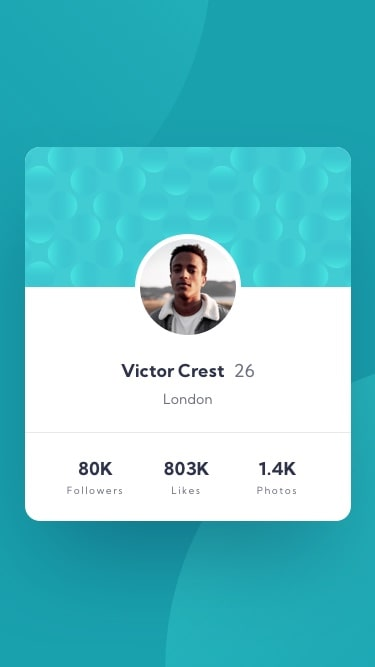

# <b> CHALLENGE - PROFILE CARD COMPONENT | <b> 

## Seja Bem-vindo(a) !!
 

Obrigado por visitar meu perfil ! Estou em busca de melhorar constantemente minhas habilidades e conhecimentos...  😁 😉 

 

###  🚀 <b> Sobre o Desafio <b>  🚀 
 
O desafio “Profile Card Component” é um dos diversos desafios propostos pelo site frontendmentor.io. Este desafio em especifico requer conhecimentos básicos em HTML e CSS, tento como base fundamental habilidades de alinhamento, espaçamento e disposição de layout. 

  

  

### <b> Habilidades utilizadas <b> 💻👨🏻‍💻🖥

 
  <ul>
    <li> HTML  </li>
   <li> CSS &nbsp;&nbsp;  </li>
    </ul>

 

 &nbsp;&nbsp;&nbsp;&nbsp; 

###  <b> Processo de desenvolvimento <b> ⌨️🖱

Depois de criar a estrutura inicial no HTML, comecei o CSS dispondo duas imagens que são regidas por uma cor predominante, após isto, dei início ao desenvolvimento do card que é o centro do desafio. 
O card em si, é constituído por quatro estruturas principais, sendo elas: 
&nbsp;&nbsp;&nbsp;&nbsp;&nbsp;&nbsp;&nbsp;&nbsp;&nbsp;- Wallpaper; 
&nbsp;&nbsp;&nbsp;&nbsp;&nbsp;&nbsp;&nbsp;&nbsp;&nbsp;- Foto de perfil; 
&nbsp;&nbsp;&nbsp;&nbsp;&nbsp;&nbsp;&nbsp;&nbsp;&nbsp;- Conteúdo central; 
&nbsp;&nbsp;&nbsp;&nbsp;&nbsp;&nbsp;&nbsp;&nbsp;&nbsp;- Status de media. 

Neste caso, criei uma div para cada estrutura e fui concluindo-a etapa por etapa. O desafio ajudou-me a enfatizar e reforçar conhecimentos adquiridos ao longo dos estudos, como o display:flex e suas propriedades e o overflow: hidden, onde eu havia esquecido o nome da propriedade, mas que após uma breve pesquisas me auxiliou com o border-radius (do card) com as bordas superiores da imagem que do wallpaper. Tive também, a liberdade em adicionar algumas estilizações, fora da prosta inicial, para que o projeto ficasse mais harmônico e agradável. 
Foi um desafio tranquilo de ser feito, mas como qualquer outro desafio, foi de muito aprendizado.  
 
<b>Apenas foram utilizados arquivos de imagens como referência sem a presença de um layout no Figma ou qualquer outra ferramenta que nos possibilitasse ter acesso a as medidas exatas utilizadas neste projeto. <b>

 

PROJETO FINALIZADO 

    

  

  

